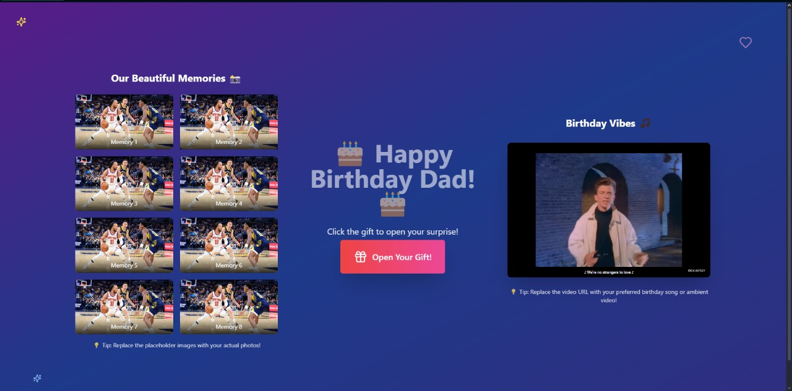

# 🎂 Birthday Surprise Project

A beautiful, interactive birthday surprise app built with React and Tailwind CSS. Perfect for creating a memorable digital birthday card for someone special!



## ✨ Features

- 📸 **Photo Collage**: Display memorable photos in an attractive grid layout
- 💌 **Interactive Gift**: Click to reveal a personalized birthday letter
- 🎵 **Ambient Video**: Embed a YouTube video to set the mood with music or memories
- ✨ **Background Elements**: Animated decorative elements that bring the page to life

## 🛠️ Technologies Used

This project leverages modern web technologies:

- **React 19**: Utilizes the latest React features for building interactive UI
- **TypeScript**: Provides type safety and better developer experience
- **Tailwind CSS**: Used for styling with utility-first CSS framework
- **Lucide React**: Supplies beautiful, consistent icons
- **PostCSS**: Processes the CSS with plugins like autoprefixer
- **Create React App**: Bootstrapped with CRA for zero configuration setup

## 🚀 Getting Started

### Prerequisites

- Node.js (version 14 or higher)
- npm (comes with Node.js)

### Installation

1. Clone this repository
```bash
git clone https://github.com/AnderssonProgramming/birthday.git
cd birthday
```

2. Install dependencies
```bash
npm install
```

3. Start the development server
```bash
npm start
```

4. (Optional) Build the project
```bash
npm run build
```

The app will open in your browser at [http://localhost:3000](http://localhost:3000).

## 📝 Customization

You can easily customize this project to create a personalized birthday surprise:

- **Photos**: Update the `PhotoCollage` component with your own images
- **Letter**: Modify the letter content in the `Letter` component
- **Video**: Change the embedded video URL in the `AmbientVideo` component
- **Colors**: Adjust the color scheme in the tailwind classes or in tailwind.config.js

---

Made with ❤️ for someone special


